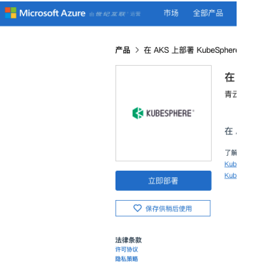
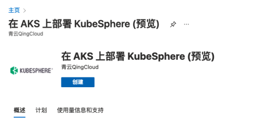
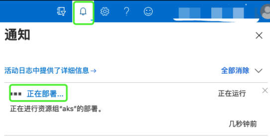
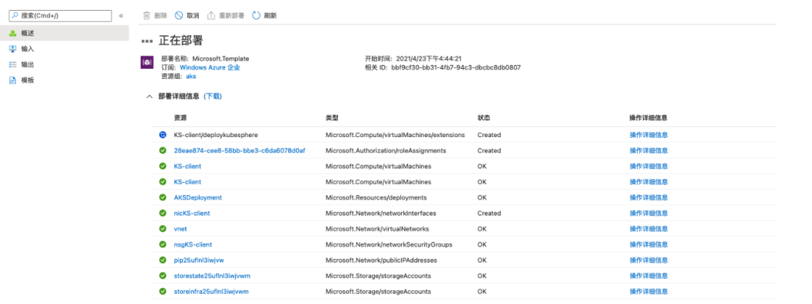
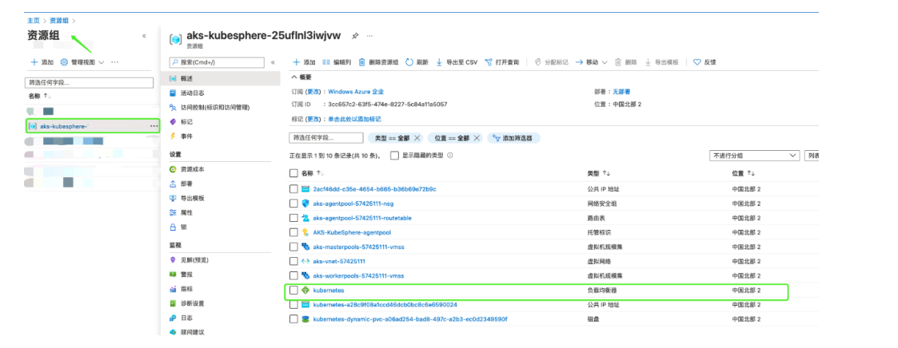
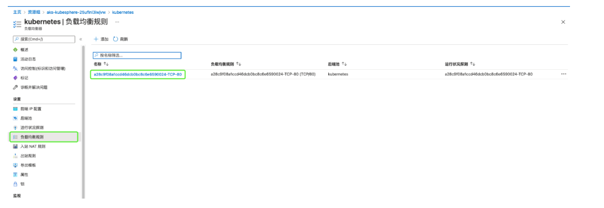
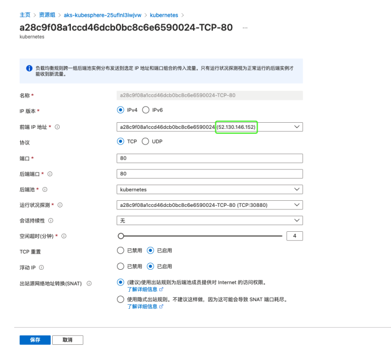
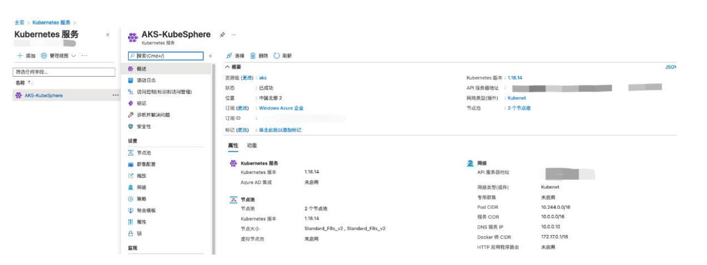
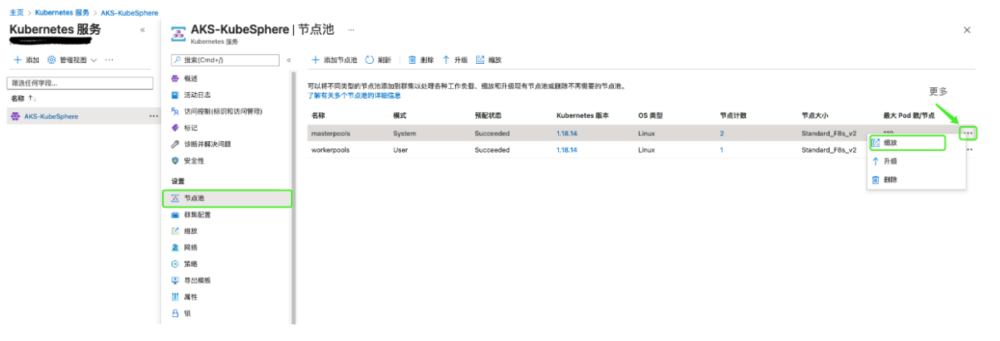
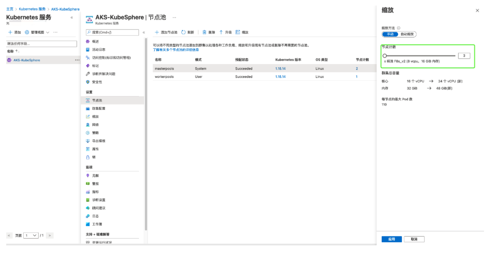

# KubeSphere on Azure 快速部署指南

> [English](README.md) | 中文

## 简介
此快速入门参考指南提供在 **Azure** 云上自动预置 **AKS** 环境并同时部署 **KubeSphere** 的详细说明，帮助 **AKS** 用户使用 **Azure Resource Manager templates** 根据 **AKS** 最佳实践在 **AKS** 上部署相关服务。

## KubeSphere on AKS
**KubeSphere** 是一个多租户企业级容器平台，拥有全栈的自动化运维和 **DevOps** 工作流。
**KubeSphere** 提供开发者友好的 **Web** 界面，帮助企业快速构建一个强大和功能丰富的容器云平台，平台上包含了企业级 **Kubernetes** 工作负载最常用的各项功能。
此快速入门基于 **Azure Resource Manager templates** 构建，帮助用户在 **Azure** 云上自动预置 **AKS** 环境并同时部署 **KubeSphere**，用户可以通过 **KubeSphere** 控制台管理 **AKS** 群集。有关 **KubeSphere** 的使用说明，请查看 **KubeSphere** 官方文档。

## 使用条款
**KubeSphere** 为开源项目，所有 **AKS** 用户均可免费使用。如果您对 **KubeSphere** 有任何疑问，请前往 [KubeSphere GitHub](https://github.com/kubesphere/kubesphere) 社区提交问题。您也可以通过 [Slack 社区](https://kubesphere.slack.com/join/shared_invite/enQtNTE3MDIxNzUxNzQ0LTZkNTdkYWNiYTVkMTM5ZThhODY1MjAyZmVlYWEwZmQ3ODQ1NmM1MGVkNWEzZTRhNzk0MzM5MmY4NDc3ZWVhMjE#/) 或[云原生服务平台](https://kubesphere.cloud/) 联系 **KubeSphere**。

## 部署
### 专业知识
此部署指南要求使用者对 AKS 的相关服务有一定程度的了解。如果您是首次使用 AKS，请访问 [AKS 服务](https://docs.microsoft.com/zh-cn/azure/aks/) ，以帮助您在 Azure 云平台上规划、部署、运维您的 AKS 群集。

### Azure 帐户
如果您还没有 Azure 帐户，请参照创建 [Azure 免费帐户](https://azure.microsoft.com/free/?WT.mc_id=A261C142F) 。

### 支持区域
AKS 并不是每个区域都可以部署。有关可以部署和运行群集的区域的最新列表，请参阅 AKS
适用区域。

### AKS 服务配额

| 资源 | 限制 |
| --- | --- |
| 每个订阅的最大群集数 |1000 |
|包含虚拟机可用性集和基本负载均衡器SKU的每个群集的最大节点数 | 100|
|包含虚拟机规模集和[标准负载均衡器 SKU](https://docs.microsoft.com/zh-cn/azure/load-balancer/load-balancer-overview) 的每个群集的最大节点数 |1000（每个节点池 100 个节点） |
| 每个节点的最大 Pod 数：带 Kubenet 的[基本网络](https://docs.microsoft.com/zh-cn/azure/aks/concepts-network#kubenet-basic-networking) | 110 |
| 每个节点的最大 Pod 数：通过 Azure 容器联网界面进行[高级联网](https://docs.microsoft.com/zh-cn/azure/aks/concepts-network#azure-cni-advanced-networking) | Azure 资源管理器模板：30 |

### 受限制的 VM 大小
请参阅 [AKS 受限制的 VM 大小](https://docs.microsoft.com/zh-cn/azure/aks/quotas-skus-regions#restricted-vm-sizes) 。

### 默认使用资源列表
| 资源 | 数量 |
| --- | --- |
| 资源组 | 2 |
| 公共 IP 地址 | 3 |
| 虚拟网络 | 2 |
| 网络安全组 | 2 |
| 网络接口 | 1 |
| 路由表 | 1 |
| 负载均衡器 | 1 |
| 虚拟机 | 1 |
| 虚拟机规模集 | 2 |
| 磁盘|4 |
| 托管标识 |1|
| 存储帐户| 2|
| Kubernetes 服务| 1|

## 部署流程
1. 前往 [Azure 官网](https://www.azure.cn/) ，使用[具有必要权限](https://docs.azure.cn/zh-cn/role-based-access-control/quickstart-assign-role-user-portal) 的帐户登录 Azure。

2. 打开[在 AKS 上部署 KubeSphere 页面](https://market.azure.cn/marketplace/apps/qingcloud.aks-kubesphere-linux) ，点击**立即部署**。

3. 请仔细阅读 Azure 门户部署 KubeSphere 页面的内容，然后点击**创建**。

4. 在**基本信息**页面配置 Azure 订阅、资源组、区域，可用区域请查阅 [AKS 适用区域](https://azure.microsoft.com/global-infrastructure/services/?products=kubernetes-service) 。操作完成后，点击下一步。

5. 在 **AKS 详细设置**页面设置 AKS 详细信息，有关 AKS 配置参数的详细说明，请查阅下方
   参数说明。操作完成后，点击下一步。

6. 在**客户端节点设置**页面设置客户端节点，有关客户端节点参数的详细说明，请查阅下
   方参数说明。操作完成后，点击下一步。

7. 确认信息后点击**创建**。

8. 点击右上角铃铛图标，在**通知**页面查看部署进度。

   

9. 显示**部署完成**则部署成功。
   
10. 在资源组中查找名为 kubernetes 的负载均衡器，查看其负载均衡规则所使用的公共 IP
    地址，详细说明请看下方查看负载均衡器使用的公共 IP。
    
## 访问 KubeSphere
- 访问地址：KubeSphere 公共 IP 地址。
- 默认管理员 (admin) 帐户和密码为 admin/P@88w0rd。

### 查看负载均衡器使用的公共 IP
1. 前往**资源组**页面，点击您用于部署 KubeSphere 的资源组，找到名为 kubernetes 的负载均衡器，点击进入其详情页。

2. 点击**负载均衡规则**查看其规则列表，然后点击具体规则。

3. 在负载均衡规则详情页的**前端 IP 地址**查看其使用的公共 IP 地址。

4. 访问该 IP 地址即可打开 KubeSphere 登录页面。

   
## 参数说明
|参数 |默认值| 描述|
| --- | --- | --- |
|订阅 |自行设置 |一个 Azure 订阅中的所有资源在一起计费。|
|资源组 |自行设置 |资源组是具有相同生命周期、权限和策略的资源集合。|
|区域 |自行设置 |资源所在区域，并非每个资源在每个区域都可用。|
|AKS 服务群集名称 |AKS-KubeSphere |Azure Kubernetes 服务群集的名称。|
|DNS 名称前缀 |AKS-KubeSphere-dns |与托管 Kubernetes API 服务器 FQDN 一起使用的 DNS 名称前缀。创建群集后，在管理容器时，可以使用此前缀连接到 Kubernetes API。|
|节点磁盘大小 |100| 为每个代理池节点预配的磁 盘大小（以 GiB 为单位）。|
|Kubernetes 版本 |1.18.14 |应用于此群集的 Kubernetes的版本。在创建群集后将能够升级此版本。|
|AKS 节点大小| Standard_F8s_v2（8 核16G，对于矢量处理工作负载，最高可提升 2 倍的性能）|将在群集中组成节点的虚拟机的大小。创建群集后不能更改此大小。|
|System 节点数 |3 |和节点一起创建的 System 节点数，您可以在群集创建后调整节点数。|
|User 节点数| 3 |和节点一起创建的 User 节点数，您可以在群集创建后调整节点数。|
|启用专用群集 |false |专用群集使用内部 IP 地址来确保 API 服务器和节点池之间的网络流量仅保留在专用网络上。|
|客户端节点名称 |KS-client| 客户端节点名称，用于管理AKS 群集，创建后不可修改虚拟机名称，但可登陆虚拟机更改主机名。|
|管理员用户名 |自行设置 |虚拟机管理员帐户|
| 认证方式 |password |客户端节点认证方式，默认为密码认证。创建完成后可以在 Azure 管理页面上重置密码。|
|管理员用户密码 |自行设置 |客户端节点密码|
|管理员用户 ssh |公钥 N/A |客户端节点公共密钥|
|客户端虚拟机节点大小 |Standard_D2_V3（2 核 8G，非高级存储）|客户端虚拟机的大小。创建群集后不能更改此大小。|

## 内置参数
该部分参数为模版内参数，用户无法修改，若有疑问请联系 KubeSphere 官方技术支持。

| 参数 |默认值 |描述|
| --- | --- | --- |
|_artifactsLocation |https://aks-scripts.s3.us-west-2.amazonaws.com/ |模版所需要的组件所在地址的根 URI，模版使用附带的脚本时，将通过模版中的位置，自动生成该值。 | 
|dnsLabelPrefix|msiXXXXXXXX|一条“A 记录”将注册到 Azure 提供的 DNS 服务器，该记录以指定标签开头并解析为此 公共 IP 地址。示例:mylabel.westus.cloudapp.azu re.com。|
|infraStorageAccountName|storeinfraXXXXXXXX|基础设施存储帐户名|
|stateStorageAccountName|storestateXXXXXXXX|状态存储帐户名|
|nicName|nicXXXX|网络接口名|
|networkSecurityGroupName|nsgXXXX|网络安全组名|
|addressPrefix|10.0.0.0/16|网络地址范围|
|subnetName|Subnet|子网名称|
|subnetPrefix|10.0.0.0/24|子网地址范围|
|AKSSubnetName|KubeSphereRG-vnet-aks|AKS 子网名称|
|AKSSubnetAddressRange|10.0.128.0/20|AKS 子网地址范围|
|networkPlugin|kubenet|网络配置|
|vmssNodePool|true|节点池使用虚拟机规模集|
|networkPolicy|calico|网络插件|
|publicIPAddressName|pipXXXX|公共 IP 地址名称|
|virtualNetworkName|vnet|虚拟网络名|
|nodeResourceGroup|aks-kubesphere-XXXXXXXX|AKS 节点资源组|

## AKS 群集管理
### AKS 群集缩放
有关如何使用 Azure CLI 缩放群集，请参考[缩放 AKS 群集](https://docs.microsoft.com/zh-cn/azure/aks/scale-cluster) 。
若通过门户网站进行缩放，请参考如下方式：
- 打开 AKS 服务页面。

- 点击**节点池**。选择需要扩容的节点池，点击右侧的“更多”按钮，选择**缩放**。

  
- 设置节点数后点击**应用**，待成功缩放节点池即可。

  
## 管理 AKS 节点池
在 Azure Kubernetes 服务 (AKS) 中，采用相同配置的节点分组成节点池。节点池包含运行应用程序的底层 VM。系统节点池和用户节点池是 AKS 群集的两种不同的节点池模式。系统节点池主要用于托管关键系统 Pod（例如 CoreDNS 和 metrics-server）。用户节点池主要用于托管应用程序 Pod。但是，如果希望在 AKS 群集中只有一个池，可以在系统节点池上计划应用程序 Pod。每个 AKS 群集必须至少包含一个系统节点池，该池至少包含一个节点。
对于系统节点池，AKS 会自动为其节点分配 kubernetes.azure.com/mode: system 标签。这使 AKS 倾向于在包含此标签的节点池上计划系统 Pod。此标签不会阻止您在系统节点池上计划应用程序 Pod。但是，我们建议将关键系统 Pod 与应用程序 Pod 隔离，以防配置错误或未授权的应用程序 Pod 意外终止系统 Pod。可以通过创建专用系统节点池来强制执行此行为。使用 CriticalAddonsOnly=true:NoSchedule 污点可防止在系统节点池上计划应用程序 Pod。
有关详细信息，请查阅[在 Azure Kubernetes 服务 (AKS) 中管理系统节点池](https://docs.microsoft.com/zh-cn/azure/aks/use-system-pools) 。

## 替换证书
有关详细信息，请查阅[轮换 Azure Kubernetes 服务 (AKS) 中的证书](https://docs.microsoft.com/zh-cn/azure/aks/certificate-rotation) 。

## 专用群集
在专用群集中，控制平面或 API 服务器具有内部 IP 地址，这些地址在 [RFC1918 - 专用 Internet 的地址分配](https://tools.ietf.org/html/rfc1918) 文档中定义。通过使用专用群集，可以确保 API 服务器与节点池之间的网络流量仅保留在专用网络上。
控制平面或 API 服务器位于 Azure Kubernetes 服务 (AKS) 托管的 Azure 订阅中。客户的群集或节点池位于客户的订阅中。服务器与群集或节点池可以通过 API 服务器虚拟网络中的 Azure 专用链接服务以及客户 AKS 群集的子网中公开的专用终结点 (Endpoint) 相互通信。
有关详细信息，请查阅[创建专用 Azure Kubernetes 服务群集](https://docs.microsoft.com/zh-cn/azure/aks/private-clusters) 。